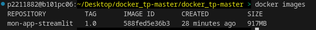
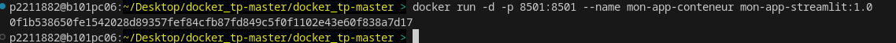
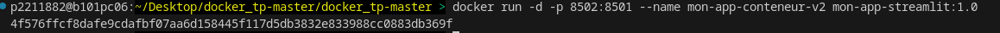
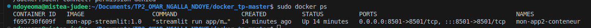

## 📌 Construction de l'image Docker

La capture ci-dessous montre le processus de **construction d'une image Docker** à partir d'un **Dockerfile**.


### 🔍 Explication des étapes :
1. **Lecture du Dockerfile & récupération des métadonnées**
   - Docker charge le `Dockerfile` et ses métadonnées.
   - Il vérifie s'il y a un fichier `.dockerignore` pour exclure certains fichiers inutiles.

2. **Téléchargement de l’image de base**
   - L’image **Python 3.11 slim** est téléchargée depuis Docker Hub.
   - Plusieurs **couches (`sha256:...`)** sont récupérées et extraites.

3. **Exécution des instructions du Dockerfile :**
   - **`WORKDIR /app`** : Définit `/app` comme répertoire de travail.
   - **`COPY requirements.txt .`** : Copie le fichier `requirements.txt` dans `/app`.
   - **`RUN pip install --no-cache-dir -r requirements.txt`** : Installe les dépendances listées dans `requirements.txt` sans mise en cache.
   - **`COPY . .`** : Copie tous les fichiers du projet dans le conteneur.

4. **Finalisation & création de l’image Docker**
   - Les couches sont exportées et l’image est **nommée `mon-app-streamlit:1.0`**.
   - L’image est sauvegardée localement avec un **SHA256 unique** (`588fde5e36b3...`).

## ✅ Conclusion  
L’image Docker a été **construite avec succès** pour l’application Streamlit ! 🚀  


## 📌 

Après la construction de l’image, nous avons exécuté la commande suivante pour vérifier son existence :

```bash
docker images

Cette commande affiche la liste des images Docker disponibles sur notre machine. Voici les informations observées :

    Nom de l’image (REPOSITORY) : mon-app-streamlit
    Version (TAG) : 1.0
    Identifiant unique (IMAGE ID) : 588fed5e36b3
    Date de création (CREATED) : Il y a 28 minutes
    Taille (SIZE) : 917MB


2 Lancement d'un Conteneur

p2211882@b101pc06:~/Desktop/docker_tp-master/docker_tp-master > docker run -p 8501:8501 --name mon-app-conteneur mon-app-streamlit:1.0

Collecting usage statistics. To deactivate, set browser.gatherUsageStats to false.


  You can now view your Streamlit app in your browser.

  URL: http://0.0.0.0:8501

2025-03-03 15:16:03.700 | INFO     | __main__:main:9 - Démarrage de l'application
2025-03-03 15:16:03.732 | DEBUG    | __main__:main:11 - Démarrage de l'application en mode debug
2025-03-03 15:16:03.732 | INFO     | src.data_loader:load_data:14 - Chargement des données
2025-03-03 15:16:03.733 | DEBUG    | src.data_loader:load_data:19 - /app/app/data/bank-additional-full.csv
2025-03-03 15:16:04.026 | INFO     | src.data_loader:load_data:21 - Données chargées : (41188, 21)
2025-03-03 15:16:05.209 | INFO     | src.eda:eda:40 - Début de l'analyse exploratoire
2025-03-03 15:16:11.202 | INFO     | src.eda:eda:144 - Analyse exploratoire terminée
2025-03-03 15:16:11.203 | INFO     | __main__:main:28 - Application terminée

-p 8501:8501 : Associe le port 8501 de la machine hôte au port 8501 du conteneur.
--name mon-app-conteneur : Donne un nom au conteneur.
mon-app-streamlit:1.0 : Utilise l’image Docker nommée mon-app-streamlit:1.0.


##3 

## 📌 Différence entre les commandes avec et sans "-d"

Lors du lancement d’un conteneur Docker, la principale différence entre l’option **`-d`** (détaché) et l’absence de cette option réside dans le **comportement du conteneur** dans le terminal.

### **1. Commande sans "-d" (mode interactif)**
```bash
docker run -p 8501:8501 --name mon-app-conteneur mon-app-streamlit:1.0
Le conteneur s'exécute en premier plan.
Les logs et l’activité du conteneur sont affichés directement dans le terminal.
Le terminal est bloqué tant que le conteneur fonctionne.
Idéal pour le débogage, car tu peux voir les logs directement.

### **2 Commande avec "-d" (mode détaché)
Le conteneur s'exécute en arrière-plan.
Le terminal n'est pas bloqué et tu peux continuer à utiliser la session pour d'autres commandes.
Pour voir les logs, tu dois utiliser la commande docker logs -f mon-app-conteneur.
En résumé : Utiliser -d permet de lancer le conteneur sans bloquer ton terminal, ce qui est plus pratique pour des applications de production.

Quelle est la meilleure façon de mettre en production une application Docker ?
La mise en production idéale avec Docker implique plusieurs éléments :

    Mode détaché (-d) : Le conteneur s'exécute en arrière-plan, ce qui est nécessaire pour les applications en production, où il doit tourner sans interruption et sans bloquer les ressources locales.
    Volumes pour la persistance des données : En production, on utilise des volumes (-v) pour que les données du conteneur soient conservées même si le conteneur est supprimé ou recréé.
    Orchestration : Pour gérer plusieurs conteneurs (par exemple avec Docker Compose ou Kubernetes), tu peux orchestrer ton application et ses services (base de données, caches, etc.).
    Surveillance des logs : Utilise des outils de surveillance pour suivre les performances de ton application en temps réel.

🚀 Exemple de mise en production avec docker-compose.yml :

    Utiliser Docker Compose pour orchestrer plusieurs conteneurs (par exemple, une application et une base de données).
    Kubernetes peut être utilisé pour gérer à grande échelle des applications réparties.


### 

### différence entre image docker et container docker.
## 📌 Différence entre une image Docker et un conteneur Docker

| **Image Docker**                              | **Conteneur Docker**                          |
|-----------------------------------------------|----------------------------------------------|
| **Modèle** ou **template** pour créer des conteneurs. | **Instance en cours d'exécution** d'une image. |
| Contient tous les fichiers nécessaires (code, dépendances, configurations). | Une image est utilisée pour créer un conteneur qui **tourne** comme un processus isolé. |
| **Statique**, ne change pas après sa création. | **Dynamique**, peut être démarré, arrêté, supprimé, ou modifié. |
| **Non-volatile** : une image ne conserve pas son état. | **Volatile** : un conteneur peut conserver des fichiers et son état, notamment s’il utilise des volumes. |
| Peut être partagée via Docker Hub ou d'autres registres. | **Local** à la machine, mais peut être partagé ou dupliqué en créant une nouvelle image. |

📌 **Exemple** :  
- L’image `mon-app-streamlit:1.0` est un modèle qui peut être utilisé pour **créer plusieurs conteneurs**.
- **Les conteneurs** créés à partir de cette image peuvent être démarrés, arrêtés et supprimés sans affecter l’image elle-même.


    ####   ETAPE 4 Manipulation de l'image et du Conteneur
## 1
## 📌 Monitoring des Conteneurs avec `docker ps`

La commande **`docker ps`** permet de lister tous les conteneurs **en cours d'exécution**. Voici la sortie obtenue lors de l'exécution de cette commande :

```bash
CONTAINER ID   IMAGE                   COMMAND                  CREATED          STATUS          PORTS                                       NAMES
4f576ffcf8da   mon-app-streamlit:1.0   "streamlit run app/m…"   6 minutes ago    Up 6 minutes    0.0.0.0:8502->8501/tcp, :::8502->8501/tcp   mon-app-conteneur-v2
0f1b538650fe   mon-app-streamlit:1.0   "streamlit run app/m…"   15 minutes ago   Up 15 minutes   0.0.0.0:8501->8501/tcp, :::8501->8501/tcp   mon-app-conteneur


Deux conteneurs sont en cours d'exécution :

    Le conteneur mon-app-conteneur a été créé il y a 15 minutes et fonctionne sur le port 8501 de la machine hôte.
    Le conteneur mon-app-conteneur-v2 a été créé il y a 6 minutes et fonctionne sur le port 8502 de la machine hôte.

ID des Conteneurs :

    Chaque conteneur a un ID unique : 4f576ffcf8da et 0f1b538650fe.

Image utilisée :

    Les deux conteneurs utilisent l'image mon-app-streamlit:1.0.

Commandes exécutées :

    Les deux conteneurs exécutent la commande streamlit run app/... pour lancer l'application.

Temps de création :

    Le conteneur mon-app-conteneur a été lancé il y a 15 minutes.
    Le conteneur mon-app-conteneur-v2 a été lancé il y a 6 minutes.

Port mappé :

    mon-app-conteneur est mappé sur le port 8501.
    mon-app-conteneur-v2 est mappé sur le port 8502, permettant ainsi de faire tourner deux conteneurs en parallèle sans conflit de ports.

Statut :

    Les deux conteneurs sont "Up", ce qui signifie qu'ils sont en cours d'exécution.


##2 
p2211882@b101pc06:~/Desktop/docker_tp-master/docker_tp-master > docker stop mon-app-conteneur
mon-app-conteneur

docker stop arrête proprement le conteneur en envoyant un signal d'arrêt. Le conteneur est alors mis dans l'état "stopped".
Le conteneur ne fonctionne plus après l'exécution de cette commande, mais ses données et son état sont conservés si nous décidons de le redémarrer plus tard avec docker start mon-app-conteneur.

###3 ![demarrage du conteneur]
p2211882@b101pc06:~/Desktop/docker_tp-master/docker_tp-master > docker start mon-app-conteneur
mon-app-conteneur

docker start permet de relancer un conteneur arrêté sans créer un nouveau conteneur.
Cette commande redémarre le conteneur dans son état actuel, y compris son état de fichier et les volumes associés.


###4  Suppression du container
p2211882@b101pc06:~/Desktop/docker_tp-master/docker_tp-master > docker rm -f mon-app-conteneur
mon-app-conteneur
ocker rm -f permet de supprimer un conteneur même s’il est en cours d'exécution (grâce à l'option -f qui force l'arrêt avant la suppression).
Après la suppression, le conteneur n'existe plus et toutes ses données non persistées seront perdues (à moins qu'il ne soit monté avec un volume).
Cette commande est utile lorsque tu veux libérer de l'espace ou nettoyer après des tests.

## verification 
p2211882@b101pc06:~/Desktop/docker_tp-master/docker_tp-master > docker ps -a
CONTAINER ID   IMAGE                   COMMAND                  CREATED          STATUS          PORTS                                       NAMES
4f576ffcf8da   mon-app-streamlit:1.0   "streamlit run app/m…"   16 minutes ago   Up 16 minutes   0.0.0.0:8502->8501/tcp, :::8502->8501/tcp   mon-app-conteneur-v2
p2211882@b101pc06:~/Desktop/docker_tp-master/docker_tp-master > 

Le conteneur mon-app-conteneur n'apparaît pas dans la liste de docker ps -a, ce qui signifie qu'il a bien été supprimé après l'exécution de la commande docker rm -f mon-app-conteneur.


## 5 Exécuter un conteneur interactivement (pour debugger ou tester) :

## 📌 Exécuter un Conteneur Interactivement avec `docker run -it`

Nous avons exécuté la commande suivante pour lancer le conteneur **`mon-app-streamlit:1.0`** en mode interactif :

```bash
docker run -it --rm mon-app-streamlit:1.0 /bin/bash
-it : Ces options permettent de lancer un conteneur en mode interactif :

    -i : Garde l'entrée ouverte, ce qui permet d'interagir avec le conteneur.
    -t : Alloue un terminal, de sorte qu’on puisse travailler avec un shell à l’intérieur du conteneur.

--rm : Supprime automatiquement le conteneur une fois que nous avons quitté (utile pour ne pas laisser de conteneurs inutiles après utilisation).
/bin/bash : Lance un shell Bash dans le conteneur, nous donnant un accès complet à son système de fichiers.

## Ou sommes-nous dans le conteneur ?

Une fois cette commande exécutée, nous nous retrouvons dans le répertoire /app du conteneur, comme indiqué par la ligne suivante dans le terminal :root@ac2a9285a7ad:/app#

root : Nous sommes connectés en tant qu'utilisateur root du conteneur, ce qui nous donne tous les privilèges nécessaires pour effectuer des actions à l'intérieur du conteneur.
ac2a9285a7ad : C’est l'ID unique du conteneur.
/app : Cela montre que notre répertoire de travail actuel dans le conteneur est /app, qui est généralement le répertoire de l’application dans les images Docker.

## 6

p2211882@b101pc06:~/Desktop/docker_tp-master/docker_tp-master > docker logs mon-app-conteneur

Collecting usage statistics. To deactivate, set browser.gatherUsageStats to false.


  You can now view your Streamlit app in your browser.

  URL: http://0.0.0.0:8501

Que se passe-t-il avec docker logs ?

    docker logs permet d'afficher les logs du conteneur spécifié.
    Cela inclut tous les messages générés par le conteneur lors de son exécution, comme les erreurs, les informations de démarrage, ou les messages d'application.

📌 Comment utiliser docker logs ?

    Pour suivre les logs en temps réel, ajoute l'option -f pour suivre les logs comme un flux en continu :


